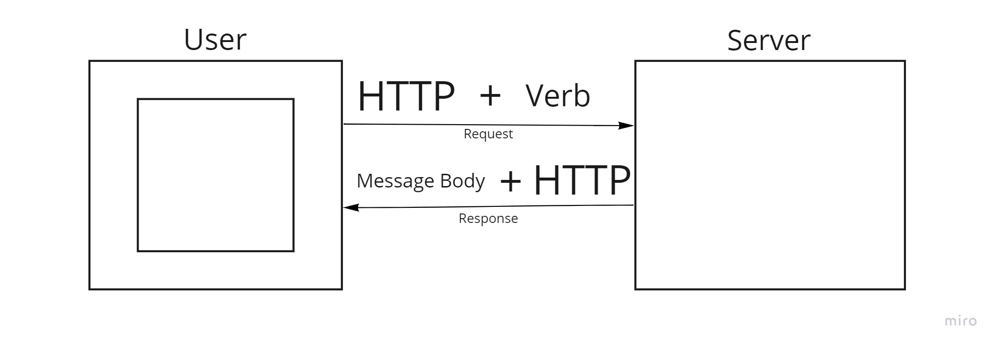

# Movies-Library
# Project Name - Project Version

**Author Name**: Alaaldin Alhanini

## WRRC
Add an image of your WRRC here

## Overview

## Getting Started
<!-- What are the steps that a user must take in order to build this app on their own machine and get it running? -->
1- Create server.js file

2- npm init -y

3- npm install express

4- const express = require("express")

5- const app = express()

6- app.listen(PORT, ()=>{ console.log("Anything") })

7- I can create end points (ex: app.get("/", name of the function))

8- I will create the function for that end point(ex: helloWorldHandler)
## Project Features
<!-- What are the features included in you app -->